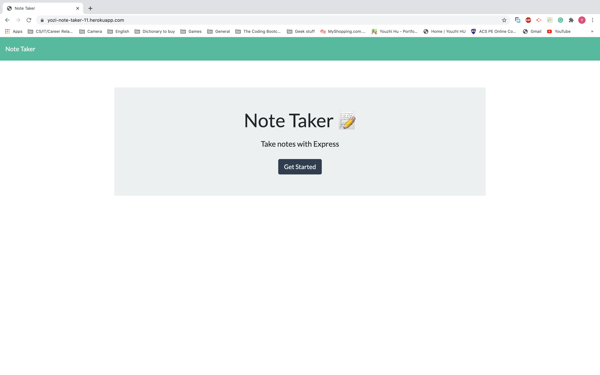

# 11-Note-Taker


## Description

An application that can be used to write, save, and delete notes. This application will use an express backend and save and retrieve note data from a JSON file.



## User Story

```
AS A user, I want to be able to write and save notes

I WANT to be able to delete notes I've written before

SO THAT I can organize my thoughts and keep track of tasks I need to complete
```

## Acceptance Criteria

```

Application should allow users to create and save notes.

Application should allow users to view previously saved notes.

Application should allow users to delete previously saved notes.
```

## Table of Contents

-   [Installation](#Installation)
-   [Usage](#Usage)
-   [License](#License)
-   [Contributing](#Contributing)
-   [Questions](#Questions)

## Installation

To install necessary dependencies, run the following command:

```
npm i
```

## Usage

For users that need to keep track of a lot of information, it's easy to forget or be unable to recall something important. Being able to take persistent notes allows users to have written information available when needed.


This app is deployed on [Heroku](https://yozi-note-taker-11.herokuapp.com/).

## License

This project is licensed under the MIT.

## Contributing

See [Questions](#Questions) section

## Questions

If you have any questions about the repo, open an issue or contact me directly at jyzhu0101@gmail.com.

You can find more of my work at [Vulgarity2Elegance](https://github.com/Vulgarity2Elegance).
